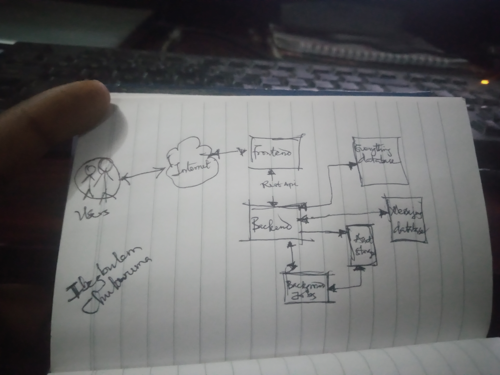
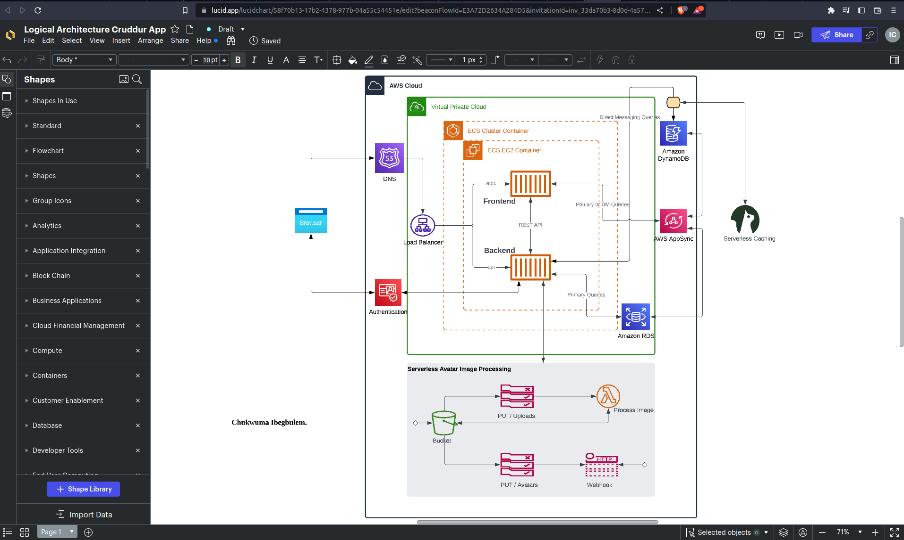
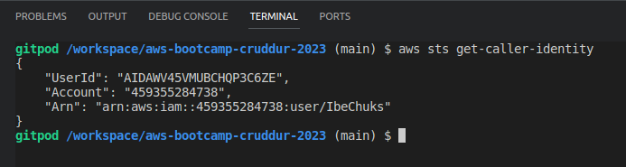
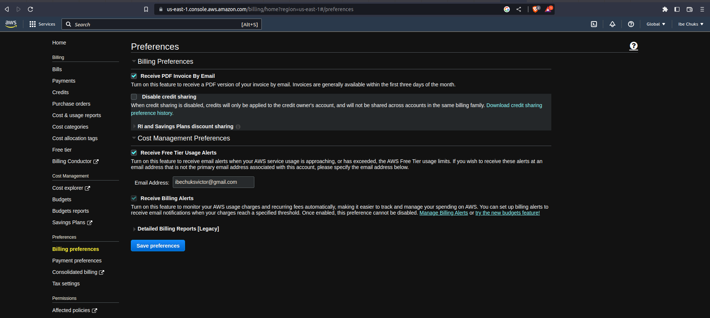
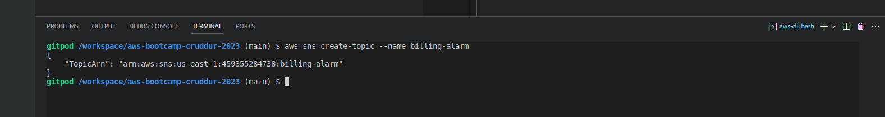
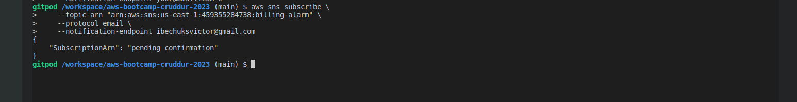
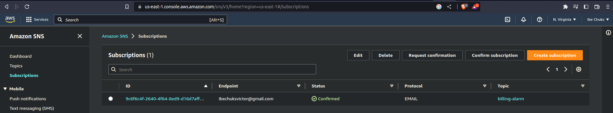

# Week 0 — Billing and Architecture

## Required Homework

### Watching Video resources
I was able to watch all the required videos to gain more insight on the scope of the bootcamp and the scope of the entire project we will be building.

I implemented some of the security best practices recommended by Chirag.

### Concept and Logical diagrams
I had issues with coming up with drawings for this aspect of the homework but I was able to get past the issues when I reached out to fellow bootcampers.

This is my own version of the concept diagram:


<br>

This reflects how I understood the project.

I was also able to recreate the Logical Architecture diagram [here](https://lucid.app/lucidchart/58f70b13-17b2-4378-977b-04a55c54451e/edit?viewport_loc=-248%2C192%2C2231%2C1253%2C0_0&invitationId=inv_33da70b3-8d0d-4a57-a006-b526045dc68e) <br>


<br>


### Install and Verify AWS CLI
I followed the video resource and was able to get ```aws cli``` working with ```gitpod```.

I did this by updating the ```.gitpod.yml``` file with this code block:

```
tasks:
  - name: aws-cli
    env:
      AWS_CLI_AUTO_PROMPT: on-partial
    init: |
      cd /workspace
      curl "https://awscli.amazonaws.com/awscli-exe-linux-x86_64.zip" -o "awscliv2.zip"
      unzip awscliv2.zip
      sudo ./aws/install
      cd $THEIA_WORKSPACE_ROOT
```
This code ensures ```AWS CLI``` is installed anytime I set up ```gitpod```

I was able to set up my aws credentials using the environment variable with these set of commands:

```
export AWS_ACCESS_KEY_ID="***********"
export AWS_SECRET_ACCESS_KEY="**********"
export AWS_DEFAULT_REGION="us-east-1"
```
To ensure the environment varaibles persisted on ```gitpod```, I ran these commands as well:

```
gp env AWS_ACCESS_KEY_ID="*************"
gp env AWS_SECRET_ACCESS_KEY="************"
gp env AWS_DEFAULT_REGION="us-east-1"
```

I ran this command to verify ```AWS CLI``` was installed and configured correctly:
```
aws sts get-caller-identity
```
output:
<br>

<br>

### Enabling Billing
Using my root account on the ```AWS Console```, on the **Billing page**, I set up my account to send out billing alerts to my email address.

<br>

### Creating a Billing Alarm
I created a billing alarm as required using the ```AWS CLI```.
I did this by setting up an alarm topic - **SNS topic**, first using this code:
```
 aws sns create-topic --name billing-alarm
 ```
 output:
 
 <br>

 I also had to create a **SNS subcription** for the topic created. I also used the ```AWS CLI```
 
 <br>

 The subcription required a confirmation via a link sent to my email.
 